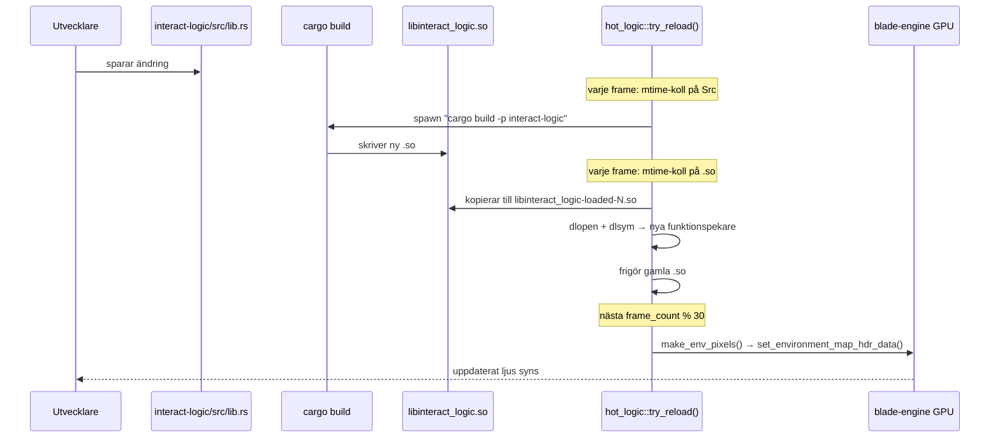
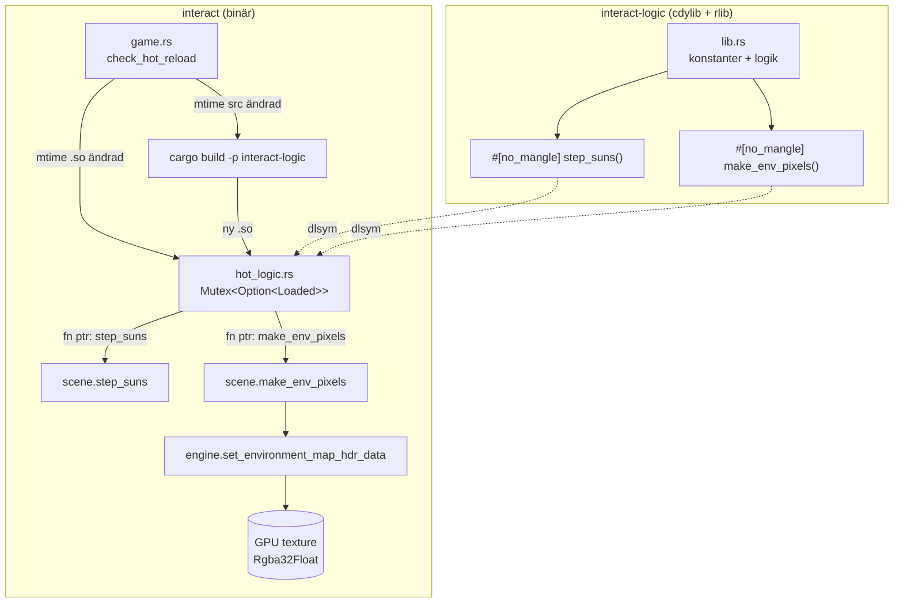

# Hot Reload

Ändra konstanter i `interact-logic/src/lib.rs` och spara — appen laddar om koden automatiskt inom ~5 sekunder utan att starta om.

## Tweakbara konstanter

```rust
// interact-logic/src/lib.rs

const SKY_ZENITH:   [f32; 3] = [0.02, 0.02, 0.5];  // himmelsfärg uppåt
const SKY_HORIZON:  [f32; 3] = [0.25, 0.08, 0.06];  // glöd vid horisonten
const SKY_NADIR:    [f32; 3] = [0.12, 0.06, 0.03];  // mark-reflektion nedåt
const SUN_INTENSITY: f32     = 2.0;                  // solarnas ljusstyrka
const SUN_RADIUS:    i32     = 1;                    // solarnas vinkkelstorlek (pixlar)
const G:             f32     = 80.0;                 // gravitationskonstant
```

## Flöde



## Arkitektur



## Varför ingen fil-I/O för env-kartan

`set_environment_map` i blade-engine cachar texturer per sökväg — samma filnamn returnerar alltid den första inlästa versionen. Lösningen är att kringgå cachen helt: `make_env_pixels()` returnerar en `Vec<[f32; 3]>` som laddas upp direkt till GPU med `set_environment_map_hdr_data()`.

## Felsökning

Kontrollera Debug Console (VS Code) för:

| Meddelande | Betydelse |
|---|---|
| `[hot_logic] reloaded interact_logic (counter=1)` | Initial laddning OK |
| `[hot_logic] source changed, spawning cargo build...` | Källfil sparad, bygger |
| `[hot_logic] reloaded interact_logic (counter=N)` | Ny version laddad |
| `[hot_logic] dlopen failed: ...` | .so korrupt eller ABI-mismatch |
